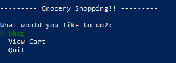
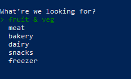
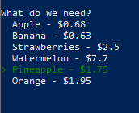
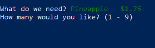
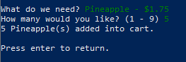
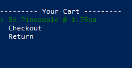
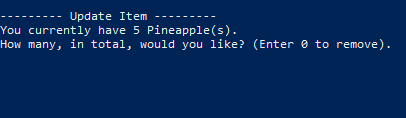
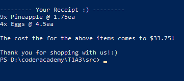
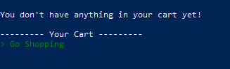
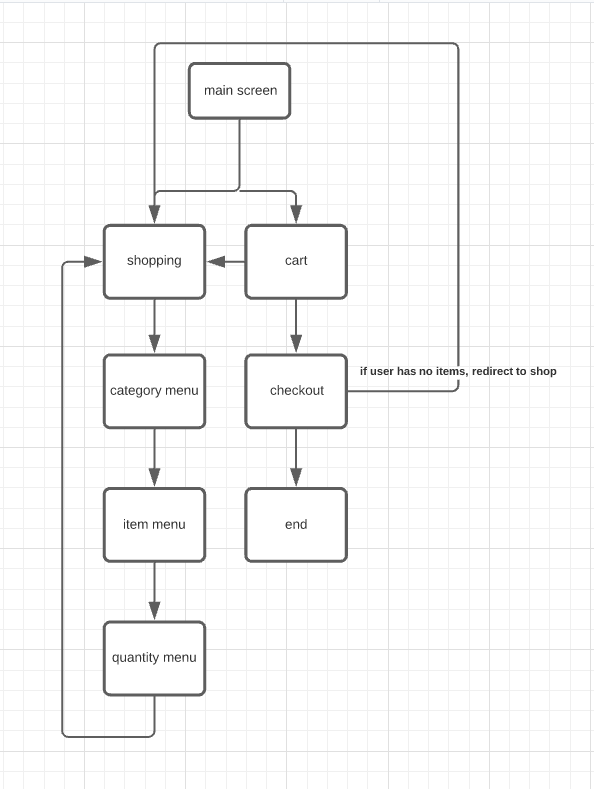

# Grocery Shopping Application

## Ruby Terminal App

Link to [repo](https://github.com/Antifact/ruby-terminal-app "GitHub Repository")

## About

### Description

This application is designed to make purchasing groceries much easier. The aim is to streamline and create and easy-to-use shopping experience for users to purchase items!!

### Functionality 

When first running the application, the user is prompted with options to begin shopping, viewing their cart or exiting the program. 

When the user selects the "Shop" menu, they will be directed to a menu where there are categories of different items. This is used to make finding items much easier. They can choose a category and then be directed to the respected items.

Once in the category menu, the user will be shown the items. They can then choose an item to add to their cart.

When a user selects an item, they will be prompted to specify how many of an item they'd like.

Once specified, the application will confirm that the amount was added to the cart. 

The will be redirected to the shop, but once they are finished, they can navigate to their cart. The user is able to change the amount of an item that is in their cart if they need to.

If the user needs to update the amount of items they have, then can select the item and specify the amount they need. 

The user will then be shown a confirmation with the amount of the item that is now in their cart. 

When the user is ready, they can check out. They will be given the total amount that their cart totals to and the application will end. 

If the user views their cart without shopping, they will be made aware that there is nothing in the cart and redirected to the shopping menu. They cannot check out if this is the case.

### Control Flow

